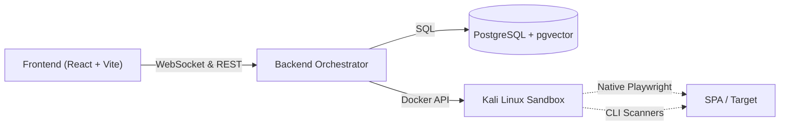

# 🛡️ Mirage — Enterprise Autonomous Penetration Testing Agent

Mirage is a fully autonomous, AI-driven penetration testing system. It mimics a Senior Penetration Tester by planning, exploiting, and memorizing findings through a sophisticated **Cognitive Architecture**.

## ✨ Core Capabilities

- 🤖 **Conscious Testing Philosophy**: Mirage hypothesizes vulnerabilities and dynamically chains tools for proof.
- ⏹️ **Responsive Stop Scan**: A multi-layered cancellation system that halts LLM calls and tool execution instantly.
- 🧠 **Neural Scratchpad Memory**: Persistent `update_memory` and Historical Context skip redundant discovery phases.
- 🌐 **SPA Native Interaction**: Integrated Node.js & Playwright for headless browser orchestration of modern web apps.
- 🧪 **Air-Gapped Sandbox**: Tools execute in a strictly isolated Kali Linux container (`mirage-sandbox`).
- 🧬 **Autonomous Arsenal**: Root-level permissions to `apt-get` or `git clone` missing tools mid-scan.

---

## 🏗️ Architecture



---

## 🚀 Getting Started

### Prerequisites
- Windows (for PowerShell scripts) or Linux/macOS (manual setup)
- Docker & Docker Compose
- OpenAI API Key (or Codex CLI login)

### 🏎️ Fast Track (Windows)

We provide hardened PowerShell scripts to manage the lifecycle of your Mirage environment autonomously.

| Operation | Command | Description |
|-----------|---------|-------------|
| **Start** | `./start.ps1` | Clears port 3000, boots Postgres, builds/runs containers, and starts Vite. |
| **Stop** | `./stop.ps1` | Gracefully shuts down containers and kills orphaned Node/Frontend processes. |

### 🛠️ Manual Installation

1. **Clone & Configure**
   ```bash
   git clone https://github.com/your-org/bb-agent.git
   cp .env.example .env # Add your OPENAI_API_KEY
   ```

2. **Launch Infrastructure**
   ```bash
   docker-compose up -d --build
   ```

3. **Start Frontend**
   ```bash
   cd frontend && npm install && npm run dev
   ```

---

## 📁 Project Structure

```text
bb-agent/
├── internal/
│   ├── agent/orchestrator.go    # ReAct Loop & Cancellation Logic
│   ├── llm/                     # OpenAI & Codex Provider (Context-aware)
│   ├── database/queries.go      # Neural Memory & Batch Status updates
│   └── docker/sandbox.go        # Isolated Docker exec controller
├── frontend/src/                # Glassmorphic React (21st.dev Style)
├── start.ps1 / stop.ps1        # Hardened Infrastructure Scripts
└── docker-compose.yml           # Multi-container orchestration
```

---

## 🔧 Operational Arsenal

| Category | Tools | AI Interaction |
|----------|-------|----------------|
| **Recon** | Nmap, Amass, Httpx | Scopes targets via IP/Domain |
| **Exploit** | Metasploit, SQLMap | Chained prove-of-vulnerability |
| **Web** | Nuclei, Gobuster | SPA crawling via Playwright |
| **Custom** | `apt-get` / `git` | Autonomous tool installation |

---

## 🛠️ Troubleshooting

- **Port 3000 Conflict**: Use `./start.ps1` on Windows; it automatically kills lingering Node processes.
- **Orphaned Scans**: If the UI shows "active" for a dead scan, just click the **Stop Scan** button in Flow Detail to force-clear it.
- **DB Connection**: Ensure `mirage-db` is healthy before starting the backend (handled natively by `start.ps1`).

---

## 📄 License
MIT License
